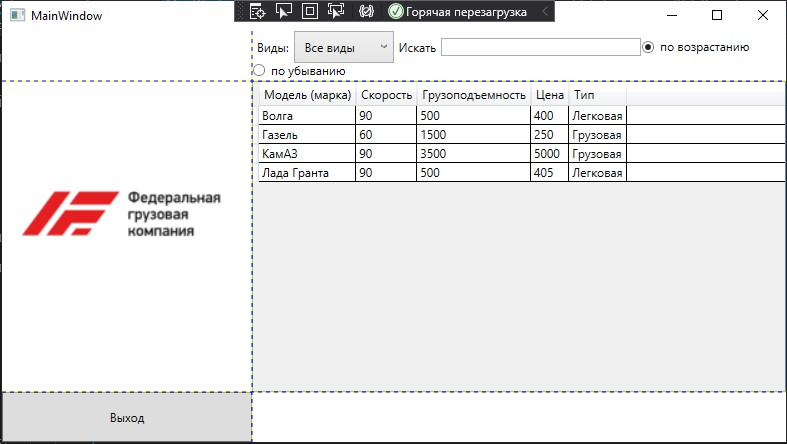

<table style="width: 100%;">
  <tr>
    <td style="text-align: center; border: none;">
    Министерство образования и науки РФ<br>
Государственное бюджетное профессиональное образовательное учреждение Республики Марий Эл<br>
Йошкар-Олинский технологический колледж
</td>
  </tr>
  <tr>
    <td style="text-align: center; border: none; height: 15em;">
    <h2 style="font-size:3em;">Отчет</h2>
      <h3>по лабораторной работе<br><br> по дисциплине "Основы алгоритмизации и программирования"<br><br> Тема:<b> "Каркас приложения. Модель данных. Привязка данных. Табличный вывод."<b> </h3></td>
  </tr>
  <tr>
    <br><br><td style="text-align: right; border: none; height: 20em;">
      Разработал:<br/>
      Смирнов Евгений <br>
      Группа: И-21<br>
      Преподаватель:<br>
      Колесников Евгений Иванович
    </td>
  </tr>
  <tr>
    <td style="text-align: center; border: none; height: 5em;">
    г.Йошкар-Ола,<br> 2021</td>
  </tr>
</table>

<div style="page-break-after: always;"></div>

# Цели и задачи:

Используя материалы лекций Фильтрация данных и Поиск, сортировка доработать WPF-приложение из прошлой лабы.
 # Краткий материал.

В приложениях часто требуется отфильтровать данные либо по словарному полю, либо по каким-либо условиям. На втором варианте мы пока останавливаться не будем - сделаем фильтрацию по словарю.

Суть фильтрации сводится к тому, что возвращается не полный список объектов, а отфильтрованный по какому-то признаку. Для получения фильтрованного списка реализуем геттер и сеттер для списка

# Что же сделал?  

Создал фильтрацию данных.
     
    ```
    <Grid ShowGridLines="True">
        <Grid.RowDefinitions>
            <RowDefinition Height="50"></RowDefinition>
            <RowDefinition></RowDefinition>
            <RowDefinition Height="50"></RowDefinition>
        </Grid.RowDefinitions>
        <Grid.ColumnDefinitions>
            <ColumnDefinition Width="250"></ColumnDefinition>
            <ColumnDefinition></ColumnDefinition>
        </Grid.ColumnDefinitions>
        <StackPanel VerticalAlignment="Bottom" Grid.RowSpan="3">
            <Button Content="Выход" Height="50"/>
        </StackPanel>
            <DataGrid
    Grid.Row="1"
    Grid.Column="1"
    CanUserAddRows="False"
    AutoGenerateColumns="False"
    ItemsSource="{Binding CarList}">
            <DataGrid.Columns>
                <DataGridTextColumn
            Header="Модель (марка)"
            Binding="{Binding Name}"/>
                <DataGridTextColumn
            Header="Скорость"
            Binding="{Binding Speed}"/>
                <DataGridTextColumn
            Header="Грузоподъемность"
            Binding="{Binding LiftingCapacity}"/>
                <DataGridTextColumn
            Header="Цена"
            Binding="{Binding Cena}"/>
            <DataGridTextColumn
            Header="Тип"
            Binding="{Binding Legko}"/>
            </DataGrid.Columns>
         </DataGrid><Image Source="/Photo/Логотип_ФГК.png" Grid.RowSpan="2"/>
        <WrapPanel Grid.Column="1">
            <Label 
    Content="Виды:"
    VerticalAlignment="Center"/>
            

            <ComboBox
    Name="LegkoFilterComboBox"
    SelectionChanged="LegkoFilterComboBox_SelectionChanged"
    VerticalAlignment="Center"
    MinWidth="100"
    SelectedIndex="0"
    ItemsSource="{Binding LegkoList}">

                <ComboBox.ItemTemplate>
                    <DataTemplate>
                        <Label 
                Content="{Binding Title}"/>
                    </DataTemplate>
                </ComboBox.ItemTemplate>
            </ComboBox>
            <Label 
    Content="Искать" 
    VerticalAlignment="Center"/>
            <TextBox
    Width="200"
    VerticalAlignment="Center"
    x:Name="SearchFilterTextBox" 
    KeyUp="SearchFilter_KeyUp" TextChanged="SearchFilterTextBox_TextChanged"/>
            <RadioButton
    GroupName="Name"
    Tag="1"
    Content="по возрастанию"
    IsChecked="True" 
    Checked="RadioButton_Checked"
    VerticalAlignment="Center"/>
            <RadioButton
    GroupName="Name"
    Tag="2"
    Content="по убыванию"
    Checked="RadioButton_Checked"
    VerticalAlignment="Center"/>
        </WrapPanel>
    </Grid>



