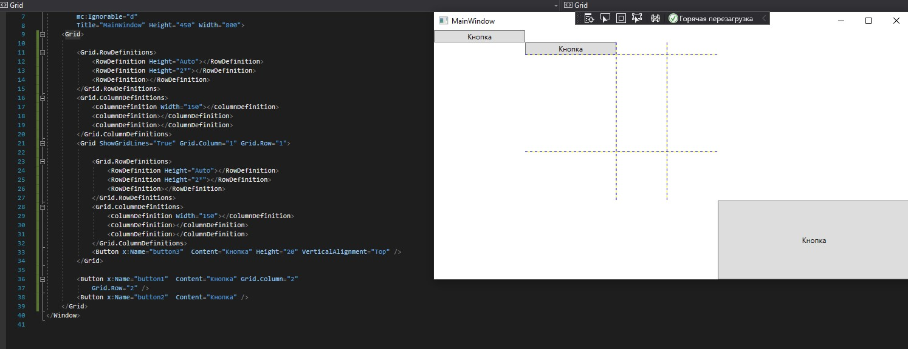
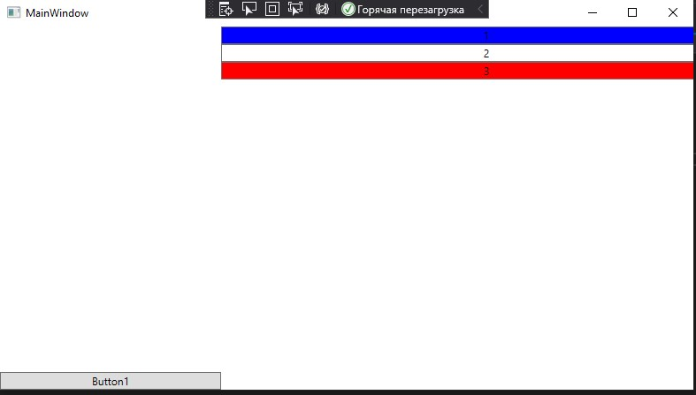

<table style="width: 100%;">
  <tr>
    <td style="text-align: center; border: none;">
    Министерство образования и науки РФ<br>
Государственное бюджетное профессиональное образовательное учреждение Республики Марий Эл<br>
Йошкар-Олинский технологический колледж
</td>
  </tr>
  <tr>
    <td style="text-align: center; border: none; height: 15em;">
    <h2 style="font-size:3em;">Отчет</h2>
      <h3>по лабораторной работе<br><br> по дисциплине "Основы алгоритмизации и программирования"<br><br> Тема:<b> "Создание WPF-приложения, знакомство с вариантами компоновки."<b> </h3></td>
  </tr>
  <tr>
    <br><br><td style="text-align: right; border: none; height: 20em;">
      Разработал:<br/>
      Соколов Артём<br>
      Группа: И-21<br>
      Преподаватель:<br>
      Колесников Евгений Иванович
    </td>
  </tr>
  <tr>
    <td style="text-align: center; border: none; height: 5em;">
    г.Йошкар-Ола,<br> 2021</td>
  </tr>
</table>

<div style="page-break-after: always;"></div>

# Цели и задачи:

1. Создать приложение WPF .NET Framework

2. Исследовать контейнеры 
    - **Grid**: создать сетку с разными типами выравнивания (auto, фискированное, динамическое)
    - **StackPanel**: создать панели с разной ориентацией и выравниванием вложенных эелементов 
    - **WrapPanel**

3. Результаты оформить в формате MarkDown с использованием примеров разметки
    
   
    ```xml
    <StackPanel>
    ...
    </StackPanel>
    ```
    
    
    и приложить скриншоты

# Краткий материал.

Если при создании традиционных приложений на основе WinForms за отрисовку элементов управления и графики отвечали такие части ОС Windows, как User32 и GDI+, то приложения WPF основаны на DirectX. В этом состоит ключевая особенность рендеринга графики в WPF: используя WPF, значительная часть работы по отрисовке графики, как простейших кнопочек, так и сложных 3D-моделей, ложиться на графический процессор на видеокарте, что также позволяет воспользоваться аппаратным ускорением графики.

Одной из важных особенностей является использование языка декларативной разметки интерфейса XAML, основанного на XML: вы можете создавать насыщенный графический интерфейс, используя или декларативное объявление интерфейса, или код на управляемых языках C# и VB.NET, либо совмещать и то, и другое.

Преимущества WPF
Что вам, как разработчику, предлагает WPF?

Использование традиционных языков .NET-платформы - C# и VB.NET для создания логики приложения

Возможность декларативного определения графического интерфейса с помощью специального языка разметки XAML, основанном на xml и представляющем альтернативу программному созданию графики и элементов управления, а также возможность комбинировать XAML и C#/VB.NET

Независимость от разрешения экрана: поскольку в WPF все элементы измеряются в независимых от устройства единицах, приложения на WPF легко масштабируются под разные экраны с разным разрешением.

Новые возможности, которых сложно было достичь в WinForms, например, создание трехмерных моделей, привязка данных, использование таких элементов, как стили, шаблоны, темы и др.

Хорошее взаимодействие с WinForms, благодаря чему, например, в приложениях WPF можно использовать традиционные элементы управления из WinForms.

Богатые возможности по созданию различных приложений: это и мультимедиа, и двухмерная и трехмерная графика, и богатый набор встроенных элементов управления, а также возможность самим создавать новые элементы, создание анимаций, привязка данных, стили, шаблоны, темы и многое другое

Аппаратное ускорение графики - вне зависимости от того, работаете ли вы с 2D или 3D, графикой или текстом, все компоненты приложения транслируются в объекты, понятные Direct3D, и затем визуализируются с помощью процессора на видеокарте, что повышает производительность, делает графику более плавной.
# Что же я делал?

1. Создал приложение WPF .NET Framework

2. Исследовал контейнеры 
    - **Grid**: создать сетку с разными типами выравнивания (auto, фискированное, динамическое)
    - **StackPanel**: создать панели с разной ориентацией и выравниванием вложенных эелементов 
    - **WrapPanel**

3. Результаты оформил в формате MarkDown с использованием примеров разметки и приложил скриншоты.
    
 
    ```xml
    <Window x:Class="WpfLabBat.MainWindow"
    xmlns="http://schemas.microsoft.com/winfx/2006/xaml/presentation"
    xmlns:x="http://schemas.microsoft.com/winfx/2006/xaml"
    xmlns:d="http://schemas.microsoft.com/expression/blend/2008"
    xmlns:mc="http://schemas.openxmlformats.org/markup-compatibility/2006"
    xmlns:local="clr-namespace:WpfLabBat"
    mc:Ignorable="d"
    Title="MainWindow" Height="450" Width="800">
    <Grid>

    <Grid.RowDefinitions>
    <RowDefinition Height="Auto"></RowDefinition>
    <RowDefinition Height="2*"></RowDefinition>
    <RowDefinition></RowDefinition>
    </Grid.RowDefinitions>
    <Grid.ColumnDefinitions>
    <ColumnDefinition Width="150"></ColumnDefinition>
    <ColumnDefinition></ColumnDefinition>
    <ColumnDefinition></ColumnDefinition>
    </Grid.ColumnDefinitions>
    <Grid ShowGridLines="True" Grid.Column="1" Grid.Row="1">

    <Grid.RowDefinitions>
    <RowDefinition Height="Auto"></RowDefinition>
    <RowDefinition Height="5*"></RowDefinition>
    <RowDefinition></RowDefinition>
    </Grid.RowDefinitions>
    <Grid.ColumnDefinitions>
    <ColumnDefinition Width="150"></ColumnDefinition>
    <ColumnDefinition></ColumnDefinition>
    <ColumnDefinition></ColumnDefinition>
    </Grid.ColumnDefinitions>
    <Button x:Name="button3" Content="Кнопка" Height="20" VerticalAlignment="Top" />
    </Grid>

    <Button x:Name="button1" Content="Кнопка" Grid.Column="2" Grid.Row="2" />
    <Button x:Name="button2" Content="Кнопка" />
    </Grid>
    </Window>
    ```
    
    
    

```xml
    <Window x:Class="WpfLabBat.MainWindow"
    xmlns="http://schemas.microsoft.com/winfx/2006/xaml/presentation"
    xmlns:x="http://schemas.microsoft.com/winfx/2006/xaml"
    xmlns:d="http://schemas.microsoft.com/expression/blend/2008"
    xmlns:mc="http://schemas.openxmlformats.org/markup-compatibility/2006"
    xmlns:local="clr-namespace:WpfLabBat"
    mc:Ignorable="d"
    Title="MainWindow" Height="450" Width="800">
    <Grid>
    <Grid.RowDefinitions>
    <RowDefinition Height="Auto"></RowDefinition>
    <RowDefinition></RowDefinition>
    <RowDefinition Height="50"></RowDefinition>
    </Grid.RowDefinitions>
    <Grid.ColumnDefinitions>
    <ColumnDefinition Width="250"></ColumnDefinition>
    <ColumnDefinition></ColumnDefinition>
    </Grid.ColumnDefinitions>
    <StackPanel VerticalAlignment="Bottom" Grid.RowSpan="3">
    <Button Content="Button1"/>
    </StackPanel>
    <WrapPanel Grid.Column="1" ItemWidth="600">
    <Button Background="Blue" Content="1" />
    <Button Background="White" Content="2" />
    <Button Background="Red" Content="3" />
    </WrapPanel>
    </Grid>
    </Window>
```

